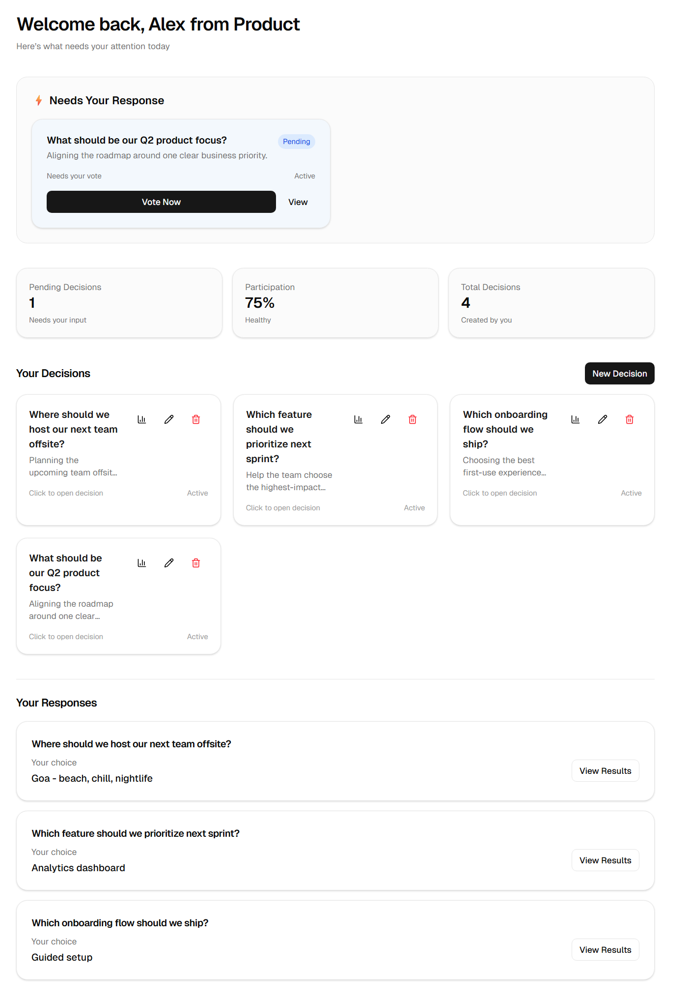
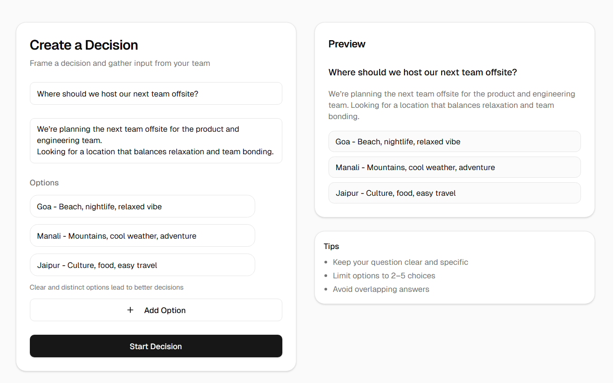
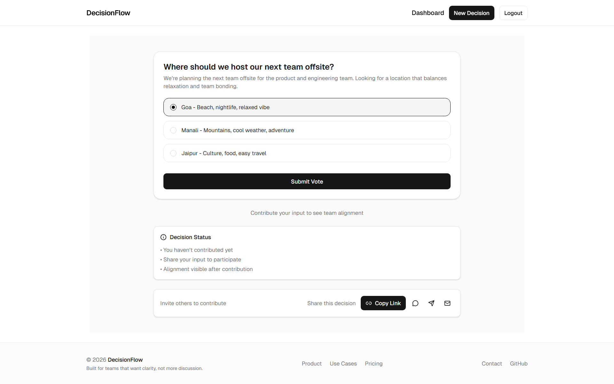
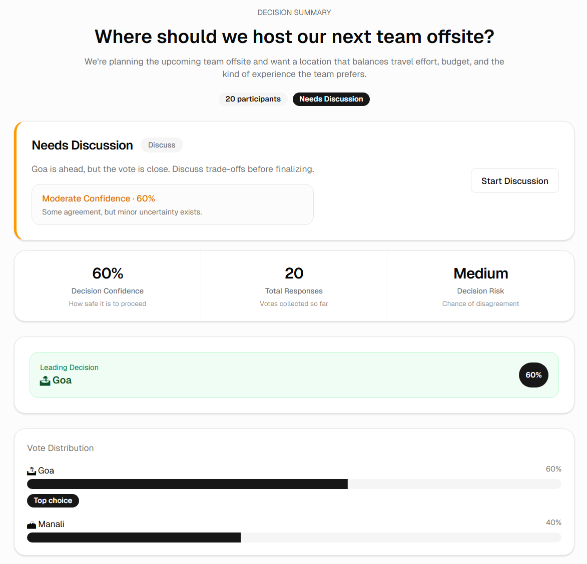

# DecisionFlow - Structured Team Decision Making

DecisionFlow is a lightweight system for making team decisions in a structured and traceable way.  
It replaces scattered discussions with a clear workflow: define options, collect input, and arrive at a decision.

Live Demo: decisionflow-app.vercel.app  
Demo Credentials:

- Email: demo@decisionflow.com
- Password: password123

---

## Table of Contents

- [Problem](#problem)
- [Solution](#solution)
- [Key Features](#key-features)
- [Architecture](#architecture)
- [Tech Stack](#tech-stack)
- [Project Structure](#project-structure)
- [Setup](#setup-and-installation)

## Problem

Decision-making in teams is often inefficient and unstructured.

- Conversations are fragmented across tools like Slack or email
- Meetings take time but do not always produce clear outcomes
- Decisions are rarely documented in a reusable format
- Context gets buried in long threads and is difficult to revisit

As teams grow, this results in slower execution, repeated discussions, and misalignment across stakeholders.

There is no simple system that makes decisions both collaborative and structured.

---

## Solution

DecisionFlow introduces a structured approach to team decisions.

Instead of relying on unstructured discussion, decisions are modeled as polls with defined options.  
Team members contribute input asynchronously, and outcomes are derived transparently.

The system focuses on:

- Reducing decision latency
- Making input collection explicit and organized
- Preserving decision history for future reference

---

## Key Features

### Decision Management

- Create decisions with multiple options
- Support flexible voting scenarios
- Maintain a centralized list of decisions

### Collaboration

- Allow multiple participants to contribute input
- Enable asynchronous decision-making without requiring meetings
- Keep all discussion context tied to the decision

### Insights and Outcomes

- Aggregate votes automatically
- Surface the most supported option clearly
- Ensure transparency in how decisions are made

### User Experience

- Minimal, task-focused interface
- Fast navigation between decisions
- Responsive layout for different screen sizes

---

## Screenshots

The following screenshots highlight the core user flows of **DecisionFlow**.

### Dashboard - Decision Overview



A central workspace to view created decisions, voting activity, and recent participation.

### Decision Creation Flow



A focused flow for creating structured team decisions with multiple options.

### Voting Interface



A simple voting experience that helps team members participate quickly.

### Result Aggregation View



Aggregated results with vote distribution, winning options, and decision insights.

---

## Architecture

The frontend is designed with a modular and scalable structure, focusing on clear separation of concerns, reusable UI primitives, and predictable data flow.

- UI is composed from reusable components and shadcn-style primitives
- Accessible base components are built on top of Radix UI
- Route-level logic is handled through dedicated page components
- State is managed through scoped contexts to avoid unnecessary global coupling
- Backend communication is isolated in a dedicated API layer
- Feature components are composed at the page level

This approach keeps the UI layer clean while ensuring that data flow and side effects are well contained.

---

## Tech Stack

- React with TypeScript
- Vite for build and development tooling
- React Router for client-side routing
- Context API for state management
- Tailwind CSS for styling
- shadcn-style UI components built with Radix UI primitives
- Lucide React for icons
- Recharts for decision result visualizations
- React Toastify for notifications
- ESLint and TypeScript for code quality

The stack is intentionally kept lightweight to prioritize development speed, maintainability, and clarity over unnecessary abstraction.

---

## Project Structure

The codebase follows a layered structure with clear ownership of responsibilities.

- `components/`  
  Reusable UI and feature components such as decision cards, vote lists, dialogs, and dashboard elements.

- `components/ui/`  
  shadcn-style UI primitives including buttons, cards, dialogs, inputs, labels, and other base elements.

- `pages/`  
  Route-level components responsible for rendering full views such as home, dashboard, decision details, and authentication flows.

- `contexts/`  
  Application state management scoped by domain such as authentication, decisions, and votes.

- `api/`  
  Centralized API layer for handling all backend communication. Encapsulates HTTP requests and keeps network logic separate from UI components.

- `layouts/`  
  Shared layout structures such as header, footer, and main layout wrappers.

- `routes/`  
  Routing configuration and protected route handling.

This structure ensures clear separation between UI, state management, routing, and backend communication, making the codebase easier to extend and maintain.

## State Management

State is managed using the Context API with domain-specific contexts.

- Authentication, decisions, and votes are handled in separate contexts
- Each context encapsulates its own state, actions, and side effects
- Components consume only the state they need, reducing unnecessary coupling

This approach keeps state localized and avoids introducing heavier solutions like Redux.

Tradeoff:

- Context API works well for the current scale
- For larger applications with more complex state interactions, a dedicated state management library could improve performance and developer experience

---

## Performance and UX Considerations

The frontend is optimized for responsiveness and predictable rendering behavior.

- Memoization is used where necessary to avoid redundant computations
- Component structure is designed to minimize unnecessary re-renders
- Routing is kept lightweight to ensure fast navigation between views
- UI feedback such as loading states and notifications improves perceived performance

The focus is on maintaining a fast and responsive interface without over-optimizing prematurely.

---

## Tradeoffs and Limitations

Some design decisions were made to keep the system simple and maintainable.

- Context API instead of a full state management library
  - Simpler setup and sufficient for current requirements
  - May require refactoring if state complexity grows significantly

- No real-time synchronization layer
  - Current implementation relies on request-response cycles
  - WebSocket integration could improve live collaboration

- Minimal role and permission handling
  - Focus is on core decision flow rather than access control
  - Can be extended for team-based use cases

These tradeoffs prioritize clarity and development speed while leaving room for future scalability improvements.

## API Integration

The frontend communicates with the backend through a centralized API layer.

- All HTTP requests are encapsulated in the `api/` directory
- UI components do not directly interact with network logic
- Responses are handled in a consistent manner across features
- Basic error handling and user feedback are integrated into the UI

This separation keeps the UI layer focused on rendering while isolating backend dependencies.

---

## Setup and Installation

### Prerequisites

- Node.js (v18 or higher)
- npm or yarn

### Installation

```bash
git clone https://github.com/KeshavAgrawal18/DecisionFlow
cd frontend
npm install
```

### Environment Variables

Create a `.env` file in the root directory:

```env
VITE_API_URL=http://localhost:3000/api
```

For production, update the value to your deployed backend URL:

```env
VITE_API_URL=https://your-backend-domain.com/api
```

### Run Development Server

```bash
npm run dev
```

### Build for Production

```bash
npm run build
```

## Future Improvements

The current implementation focuses on core decision workflows. The following enhancements can extend the system further:

- Real-time updates using WebSockets for live collaboration
- Role-based access control for teams and organizations
- Improved analytics for decision trends and participation
- Notification system for decision updates
- Offline support and caching for better reliability

---

## About

Developed by Keshav Agrawal.

Focused on building scalable and maintainable systems with emphasis on clean architecture, performance, and user experience.

GitHub: https://github.com/KeshavAgrawal18

LinkedIn: https://linkedin.com/in/keshav-agrawal-ka
